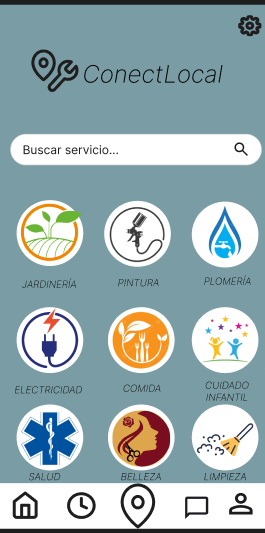
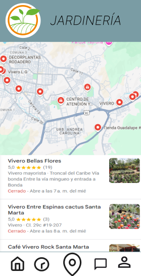
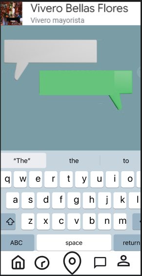

# Diseño de interfaz de usuario

La interfaz de usuario de la aplicación ConectLocal esta inspirada en la interfaz de usuario de
aplicaicones similares.

El diseño completo esta disponible en [Figma](https://www.figma.com/design/QbyfAC4kDzlfa9X1VdgjlC/Untitled?node-id=0-1&node-type=CANVAS&t=qf5PilVE82HXPxsT-0)
A continuación se
presentan las principales pantallas:

1. Home 

   Cuando el usuario ingrese a la aplicaicón verá un menú de servicios entre los que podrá elegir.

   

2. Ubicación

   Al seleccionar un servicio el usuario verá un mapa con los negocios mas cercanos a su ubicación actual.

   

3. Mensajería

   Adicionalmente el usuario podrá seleccionar una empresa y contactarse con ella para información personalizada.

   
